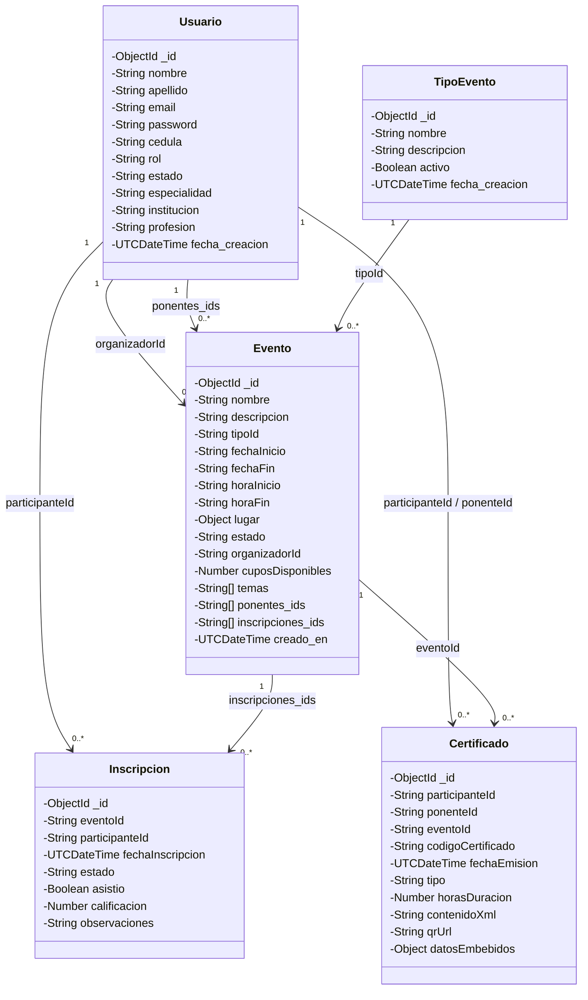

# INFORME FINAL DE PROYECTO: KOSMOS — SISTEMA DE GESTIÓN DE EVENTOS ACADÉMICOS

---

## Ficha de Identificación del Proyecto

* **Nombre del Sistema:** Kosmos — Sistema de Gestión de Eventos Académicos
* **Etimología:** Inspirado en el vocablo griego *Kósmos* (κόσμος), que denota "Orden", "Estructura armónica" y "Universo ordenado", en contraposición al caos y la dispersión operativa de la gestión académica tradicional.
* **Asignatura:** Base de Datos II (CIVA 2026)
* **Grupo Asignado:** Grupo 4
* **SGBD y Tecnologías Asignadas:** MongoDB (NoSQL Documental / BSON) + Integración Documental XML
* **Stack Tecnológico:**
  * **Base de Datos:** MongoDB Community Server 7.x / 8.x (Extension PHP `mongodb`)
  * **Backend / API:** PHP 8.3 Vanilla (Arquitectura RESTful orientada a servicios JSON)
  * **Procesamiento de Documentos:** PHP `DOMDocument` (Generación de XML individual y validación bajo DTD)
  * **Frontend:** SPA (Single Page Application) basada en HTML5, CSS3 Glassmorphism y JavaScript Vanilla (ES6+)
  * **Renderizado Vectorial en Cliente:** `jsPDF` (Diplomas digitales A4 de alta definición) y `qrcode.js`
* **Entregables Integrados:** Semana I (Modelado y Fundamentos XML), Semana II (Arquitectura, Persistencia y CRUD Web), Semana III (Reglas de Negocio, Agregaciones y Distribución), Semana IV (Datos Especializados, Multimedia BSON y jsPDF) y Semana V (Cuadro Comparativo y Cierre).

---

## Resumen Ejecutivo

El proyecto **Kosmos** constituye una plataforma integral para la planificación, ejecución, certificación y auditoría de eventos académicos universitarios (conferencias, talleres, seminarios, congresos y simposios). Desarrollado para el **Grupo 4** bajo el enfoque NoSQL Documental con integración XML, el sistema erradica las deficiencias históricas de la gestión manual (duplicidad de registros, saturación de cupos, falsificación o aglutinamiento tipográfico en diplomas y desarticulación de estadísticas institucionales). 

El núcleo arquitectónico del sistema aprovecha la naturaleza semiestructurada de los datos mediante colecciones BSON en **MongoDB** con validación estricta de esquemas (`$jsonSchema`), pipelines de agregación multidimensionales (`Aggregation Pipelines`), un middleware centralizado de reglas de negocio con resolución automática de estados por fecha/hora y particionamiento horizontal simulado. Adicionalmente, el sistema implementa una vinculación automatizada **BSON ↔ XML**, asegurando la persistencia inmutable de certificados digitales con códigos QR dinámicos, plantillas parametrizadas en base de datos, generación vectorial en cliente mediante **`jsPDF`** y un verificador público de autenticidad.

---

# 1. Marco Introductorio y Fundamentación del Problema

## 1.1 Contexto Institucional Universitario
En el ámbito de la educación superior, los centros de investigación y las dependencias de extensión académica, la divulgación científica se materializa a través de eventos periódicos. No obstante, la información suele administrarse de forma descentralizada mediante hojas de cálculo aisladas, formularios desconectados y expedición manual de constancias físicas, impidiendo un control riguroso de asistencia, ponentes y trazabilidad histórica.

## 1.2 Descripción del Problema
1. **Gestión manual y propensa a colisiones:** Inscripciones artesanales sin verificación atómica de cupos disponibles ni control de registros duplicados.
2. **Desarticulación en la gestión de ponentes:** Carencia de un repositorio centralizado de perfiles docentes, trayectorias e historial de asignaciones.
3. **Falta de control de asistencia:** Inexistencia de un mecanismo estandarizado para validar la asistencia real de los participantes como condición previa a la acreditación.
4. **Emisión ineficiente de certificados:** Generación manual propensa a errores tipográficos, formatos heterogéneos y ausencia de mecanismos digitales de auditoría.
5. **Reportes analíticos deficientes:** Imposibilidad de responder oportunamente a interrogantes tácticas sobre meses de mayor afluencia, popularidad temática o índices de participación.

## 1.3 Justificación del Proyecto
* **Justificación Tecnológica:** Los eventos académicos presentan atributos heterogéneos (fechas variables, listas dinámicas de temas, ponentes colegiados, ubicaciones con subdocumentos y modalidades diversas). **MongoDB** permite modelar estas entidades de forma semiestructurada en BSON sin penalizaciones de esquema. A su vez, **XML** actúa como estándar formal de intercambio y preservación documental internacional, garantizando la inmutabilidad de los diplomas.
* **Justificación Académica:** Aplica de manera transversal las competencias de la asignatura Base de Datos II: diseño NoSQL, pipelines de agregación complejos, esquemas `$jsonSchema`, integración XML/DTD/XPath, datos especializados multimedia y evaluación comparativa entre paradigmas.
* **Justificación Funcional:** Ofrece una experiencia reactiva moderna en modo oscuro neón para 4 roles bien diferenciados (Admin, Organizador, Ponente, Participante), garantizando la integridad de datos desde la captura hasta la verificación pública de certificaciones.

## 1.4 Análisis Teórico del Tipo de Datos Utilizado
En la ciencia de datos contemporánea, la información se cataloga en tres categorías:

| Categoría de Datos | Definición Conceptual | Ejemplo Tradicional | ¿Aplica a Kosmos? |
| :--- | :--- | :--- | :--- |
| **Estructurados** | Esquemas rígidos, tabulares y bidimensionales donde cada registro posee exactamente los mismos campos y tipos de longitud fija. | Tablas relacionales normalizadas (3FN) en PostgreSQL con columnas predefinidas. | **No:** Forzaría una sobreingeniería de tablas intermedias para listas dinámicas (temas, ponentes, snapshots históricos). |
| **Semi-estructurados** | Datos con organización interna y jerárquica reconocible (pares clave-valor, etiquetas o subdocumentos), pero donde el esquema puede variar entre instancias. | Documentos JSON/BSON con subdocumentos embebidos y árboles XML bajo DTD. | **SÍ (Seleccionado):** Un evento puede tener 1 o 10 temas; un ponente posee especialidad mientras el participante posee profesión; y un certificado guarda un snapshot histórico de datos embebidos. |
| **No estructurados** | Archivos sin modelo conceptual ni etiquetas semánticas para consultas analíticas directas. | Texto libre en correos, audios sin procesar o transmisiones de video. | **No:** Kosmos requiere consultas analíticas indexadas, filtros por fechas y validación de integridad. |

## 1.5 Justificación de la Elección de MongoDB frente a Alternativas

| Paradigma / Motor | Viabilidad Técnica | Limitaciones Detectadas para el Proyecto | Decisión en Kosmos |
| :--- | :--- | :--- | :--- |
| **PostgreSQL (Relacional Puro)** | Posible pero restrictivo | Exige 8+ tablas normalizadas y uniones (`JOIN`) complejas para recuperar un evento con sus ponentes, temas y lugar embebido. Modificar campos requiere migraciones costosas (`ALTER TABLE`). | Descartado para el Grupo 4. |
| **PostgreSQL + JSONB (Multimodelo)** | Buena alternativa híbrida | Mezcla paradigmas en un motor con sobrecarga de configuración; la sintaxis de consulta y operadores JSONB (`->>`, `@>`) resulta más compleja que las consultas nativas en BSON. | Asignado a otros grupos. |
| **PostgreSQL + PostGIS (Espacial)** | Específico para GIS | Excelente para geometrías geográficas, pero innecesario para un sistema centrado en eventos académicos, ponencias y emisión documental. | Asignado al Grupo 5. |
| **MongoDB (NoSQL Documental)** | **Óptima y Nativa** | Diseñado nativamente para documentos jerárquicos BSON, consultas de agregación analítica, validación por `$jsonSchema` e indexación de subdocumentos embebidos. | **SELECCIONADO (Grupo 4)** |

## 1.6 Objetivos del Proyecto
* **Objetivo General:** Desarrollar un sistema de gestión de eventos académicos utilizando tecnologías NoSQL (MongoDB) y procesamiento de documentos XML, que permita la administración eficiente de eventos, ponentes, participantes e inscripciones, garantizando la generación y verificación automatizada de certificados digitales.
* **Objetivos Específicos:**
  1. Diseñar e implementar el modelo de datos basado en colecciones BSON optimizadas con esquemas de validación `$jsonSchema`, índices y middleware centralizado de negocio.
  2. Implementar una API RESTful en PHP Vanilla que soporte operaciones CRUD atómicas y pipelines de agregación para responder a las consultas analíticas del sistema.
  3. Automatizar la generación documental BSON $\leftrightarrow$ XML con DTD formal, visor de diplomas vectoriales en el cliente con `jsPDF` y módulo de auditoría pública mediante códigos QR.

---

# 2. Análisis de Dominio y Modelado Conceptual (Semana I)

## 2.1 Usuarios del Sistema y Consolidación de Roles
El análisis de requerimientos original contemplaba un rol denominado *"Personal de extensión universitaria"*. Tras la revisión arquitectónica de la Semana I, se decidió unificarlo con el rol **Organizador** para eliminar solapamientos funcionales, estableciendo una matriz canónica de 4 roles:

| Rol | Descripción Funcional | Permisos Clave en el Sistema |
| :--- | :--- | :--- |
| **Admin** | Administrador global de infraestructura y gobierno de datos. | CRUD total de usuarios (4 roles), edición/eliminación de eventos, emisión de certificados y acceso irrestricto a reportes analíticos. No crea eventos para preservar la responsabilidad organizativa. |
| **Organizador** | Responsable académico y logístico de los eventos. | **Único rol facultado para crear eventos**. Registra y gestiona ponentes, supervisa inscripciones, confirma asistencia, emite certificados y consulta reportes de sus eventos. |
| **Ponente** | Académico o especialista que imparte conferencias o talleres. | Consulta los eventos asignados a su perfil, visualiza sus certificados emitidos como ponente y administra su perfil profesional. |
| **Participante** | Estudiante, investigador o público asistente. | Explora el catálogo de eventos, se auto-inscribe con control de cupos, descarga diplomas PDF y XML de eventos aprobados y audita sus inscripciones. |

## 2.2 Los Cinco Procesos Principales del Sistema
1. **Gestión Integral de Eventos Académicos:** Creación, edición, consulta facetada, cálculo automatizado de estado y borrado de eventos.
2. **Gestión y Asignación de Ponentes:** Registro de perfiles con especialidad académica e institución de procedencia, vinculándolos a los eventos.
3. **Control de Inscripciones y Asistencia:** Registro de participantes, verificación atómica de cupos disponibles, prevención de duplicados y confirmación de asistencia obligatoria.
4. **Generación Automatizada de Certificados BSON/XML:** Emisión tras validación de asistencia, construcción de árbol XML, registro de QR dinámico y generación de PDF vectorial.
5. **Analítica Institucional y Auditoría:** Ejecución de agregaciones para responder a las 10 preguntas estratégicas del negocio y verificación pública de certificados.

## 2.3 Catálogo de Objetos del Dominio
* **`Evento` (Colección):** Documento central con metadatos del evento, fechas, horas, cupos, lugar embebido, temas y arreglos de referencias cruzadas (`ponentes_ids`, `inscripciones_ids`).
* **`TipoEvento` (Colección Catálogo `tipos_evento`):** Clasificación promovida a colección independiente (*Conferencia, Taller, Seminario, Congreso, Simposio*) para garantizar integridad referencial y evitar migraciones en caliente.
* **`Usuario` (Colección `usuarios`):** Entidad polimórfica que almacena a todos los actores del sistema aplicando validación condicional según el campo `rol`.
* **`Inscripcion` (Colección `inscripciones`):** Vínculo transaccional entre un participante y un evento, registrando fecha, estado y asistencia.
* **`Certificado` (Colección `certificados`):** Documento inmutable emitido que almacena el código único, contenido XML nativo, URL de verificación y snapshot `datosEmbebidos`.
* **`Multimedia` (Colección `multimedia`):** Repositorio BSON para activos gráficos institucionales (Logo) y códigos QR dinámicos.
* **`PlantillaCertificado` (Colección `plantillas_certificados`):** Parametrización en BD de textos y estilos de acreditación.

## 2.4 Modelo Conceptual UML



## 2.5 Las Diez Preguntas Estratégicas del Negocio

| # | Pregunta Estratégica | Entidades Involucradas | Propósito Administrativo |
|---|---|---|---|
| **Q1** | ¿Qué eventos existen en un mes determinado? | `eventos`, `tipos_evento` | Planificación de calendario y detección de saturación mensual. |
| **Q2** | ¿Qué ponentes participan en un evento determinado? | `eventos`, `usuarios` | Logística, acreditación docente y agendas de viaje. |
| **Q3** | ¿Qué participantes se inscribieron en un evento determinado? | `eventos`, `inscripciones`, `usuarios` | Control de matrícula, quórum y listados de contacto. |
| **Q4** | ¿Qué eventos ha dictado un ponente determinado? | `eventos`, `usuarios`, `tipos_evento` | Hoja de vida académica y carga horaria del expositor. |
| **Q5** | ¿Cuántos participantes tuvo cada evento? | `eventos`, `inscripciones` | Métricas de impacto y cálculo de tasa de ocupación. |
| **Q6** | ¿Qué participantes asistieron a un evento determinado? | `eventos`, `inscripciones`, `usuarios` | Validación estricta para la emisión de diplomas digitales. |
| **Q7** | ¿Qué certificados se han generado? | `certificados`, `eventos` | Auditoría de acreditaciones otorgadas y trazabilidad legal. |
| **Q8** | ¿Qué eventos pertenecen a un tipo determinado? | `eventos`, `tipos_evento` | Clasificación por modalidad académica (talleres, congresos). |
| **Q9** | ¿Qué temas se han tratado en los eventos? | `eventos` | Detección de líneas de investigación emergentes. |
| **Q10** | ¿Cuál es el evento con mayor cantidad de participantes? | `eventos`, `inscripciones` | Reconocimiento al evento de mayor impacto institucional. |

## 2.6 Estructura del Documento XML Inicial y Validación DTD

### Definición de Tipo de Documento (`kosmos.dtd`)
```xml
<?xml version="1.0" encoding="UTF-8"?>
<!ELEMENT kosmos (evento+)>
<!ELEMENT evento (nombre, descripcion, tipo, fechaInicio, fechaFin,
                  horaInicio, horaFin, lugar, estado, organizador,
                  cuposDisponibles, temas, ponentes, participantes,
                  inscripciones, certificados)>
<!ATTLIST evento id ID #REQUIRED>
<!ELEMENT nombre (#PCDATA)>
<!ELEMENT descripcion (#PCDATA)>
<!ELEMENT tipo (#PCDATA)>
<!ELEMENT fechaInicio (#PCDATA)>
<!ELEMENT fechaFin (#PCDATA)>
<!ELEMENT horaInicio (#PCDATA)>
<!ELEMENT horaFin (#PCDATA)>
<!ELEMENT lugar (nombre, direccion, aula, capacidad)>
<!ELEMENT direccion (#PCDATA)>
<!ELEMENT aula (#PCDATA)>
<!ELEMENT capacidad (#PCDATA)>
<!ELEMENT estado (#PCDATA)>
<!ELEMENT organizador (#PCDATA)>
<!ELEMENT cuposDisponibles (#PCDATA)>
<!ELEMENT temas (tema+)>
<!ELEMENT tema (#PCDATA)>
<!ELEMENT ponentes (ponente+)>
<!ELEMENT ponente (nombre, apellido, email, institucion, especialidad)>
<!ATTLIST ponente id ID #REQUIRED>
<!ELEMENT apellido (#PCDATA)>
<!ELEMENT email (#PCDATA)>
<!ELEMENT institucion (#PCDATA)>
<!ELEMENT especialidad (#PCDATA)>
<!ELEMENT participantes (participante+)>
<!ELEMENT participante (nombre, apellido, email, institucion, profesion, cedula)>
<!ATTLIST participante id ID #REQUIRED>
<!ELEMENT profesion (#PCDATA)>
<!ELEMENT cedula (#PCDATA)>
<!ELEMENT inscripciones (inscripcion+)>
<!ELEMENT inscripcion (participanteRef, fechaInscripcion, estado, asistio)>
<!ATTLIST inscripcion id ID #REQUIRED>
<!ELEMENT participanteRef (#PCDATA)>
<!ELEMENT fechaInscripcion (#PCDATA)>
<!ELEMENT asistio (#PCDATA)>
<!ELEMENT certificados (certificado+)>
<!ELEMENT certificado (participanteRef, codigoCertificado, fechaEmision, tipo, horasDuracion)>
<!ATTLIST certificado id ID #REQUIRED>
<!ELEMENT codigoCertificado (#PCDATA)>
<!ELEMENT fechaEmision (#PCDATA)>
<!ELEMENT horasDuracion (#PCDATA)>
```

## 2.7 Consultas XPath Fundamentales
1. **Catálogo General de Nombres:** `/kosmos/evento/nombre`
   * *Propósito:* Proyecta una lista plana de todos los eventos registrados.
2. **Filtrado por Predicado:** `/kosmos/evento[tipo='conferencia']/nombre`
   * *Propósito:* Filtra los eventos cuya categoría sea estrictamente "conferencia".
3. **Ponentes de un Evento Específico:** `/kosmos/evento[@id='EVT001']/ponentes/ponente`
   * *Propósito:* Navega hacia el subárbol del evento `EVT001` y extrae sus disertantes.
4. **Listado de Participantes:** `/kosmos/evento/participantes/participante`
   * *Propósito:* Retorna la colección de asistentes con cédula y profesión.
5. **Auditoría de Códigos Únicos:** `/kosmos/evento/certificados/certificado/codigoCertificado`
   * *Propósito:* Extrae los identificadores criptográficos emitidos para validación.

---

# 3. Arquitectura del Sistema, Persistencia y API REST (Semana II)

## 3.1 Arquitectura de la Solución
Kosmos opera bajo un patrón desacoplado **Cliente-Servidor (SPA + REST API)**:
* **Frontend:** Aplicación de página única servida de forma estática en `public/index.html`. Interactúa mediante peticiones asíncronas (`fetch`) con cabeceras `Content-Type: application/json`.
* **Backend:** Endpoints modulares en PHP 8.3 Vanilla alojados en `api/`, estructurados según el verbo HTTP (`GET`, `POST`, `PUT`, `DELETE`).
* **Capa de Conexión:** Gestor singleton en `api/config/database.php` que inicializa el cliente nativo `MongoDB\Driver\Manager`.

```
┌─────────────────────────────────────────────────────────────┐
│                 CLIENTE WEB (SPA - HTML5 / CSS3 / ES6)       │
│  - Control de Vistas (Eventos, Inscripciones, Certificados) │
│  - jsPDF Engine + Canvas (Generación Diploma en Navegador)  │
│  - Kosmos Dialog System (Modales reactivos con Promesas)    │
└──────────────────────────────┬──────────────────────────────┘
                               │ JSON / HTTP REST
                               ▼
┌─────────────────────────────────────────────────────────────┐
│                BACKEND REST (PHP 8.3 Vanilla)               │
│  - Endpoints CRUD: eventos, usuarios, inscripciones, certs. │
│  - Middleware Centralizado: ReglasNegocio.php               │
│  - Motor DOMDocument: Generación de XML conforme a DTD      │
└──────────────────────────────┬──────────────────────────────┘
                               │ Conexión Nativa BSON
                               ▼
┌─────────────────────────────────────────────────────────────┐
│                 MOTOR DE BASE DE DATOS MONGODB              │
│  - Colecciones BSON: eventos, usuarios, inscripciones, etc. │
│  - Esquemas de Validación BSON ($jsonSchema)                │
│  - Aggregation Pipelines (Consultas Analíticas Q1..Q10)     │
└─────────────────────────────────────────────────────────────┘
```

## 3.2 Diagrama Entidad-Relación Físico en MongoDB

```text
+-----------------------------------------------------------------------------------------+
|                                  COLECCIONES MONGODB                                    |
+-----------------------------------------------------------------------------------------+
|                                                                                         |
|   +-------------------+         +-------------------+         +---------------------+   |
|   |     usuarios      |         |   tipos_evento    |         |       eventos       |   |
|   |-------------------|         |-------------------|         |---------------------|   |
|   | _id (ObjectId)    |<----+   | _id (ObjectId)    |<--------| tipoId (ObjectId)   |   |
|   | nombre (string)   |     |   | nombre (string)   |         | _id (ObjectId)      |   |
|   | apellido (string) |     |   | descripcion (str) |         | nombre (string)     |   |
|   | email (unique)    |     |   | activo (bool)     |         | descripcion (string)|   |
|   | password (hash)   |     |   | creado_en (date)  |         | fechaInicio (date)  |   |
|   | cedula (unique)   |     |   +-------------------+         | fechaFin (date)     |   |
|   | rol (enum 4)      |     |                                 | horaInicio/Fin (str)|   |
|   | especialidad*     |     |                                 | lugar (subdocumento)|   |
|   | institucion*      |     |                                 | estado (enum 4)     |   |
|   | profesion*        |     |                                 | organizadorId (str) |-+ |
|   | estado (string)   |     |                                 | cuposDisponibles    | | |
|   +---------+---------+     |                                 | temas (array[str])  | | |
|             |               |                                 | ponentes_ids[]      |-+ |
|             |               |                                 | inscripciones_ids[] |-+ |
|             |               |                                 +----------+----------+ | |
|             |               |                                            |            | |
|             |               |           +--------------------+           |            | |
|             |               |           |   inscripciones    |           |            | |
|             |               |           |--------------------|           |            | |
|             +---------------+---------->| participanteId(str)|           |            | |
|                             |           | eventoId (str)     |<----------+            | |
|                             |           | _id (ObjectId)     |                        | |
|                             |           | fechaInscr. (date) |                        | |
|                             |           | estado (enum 3)    |                        | |
|                             |           | asistio (bool)     |                        | |
|                             |           +--------------------+                        | |
|                             |                                                         | |
|                             |           +--------------------+                        | |
|                             |           |    certificados    |                        | |
|                             |           |--------------------|                        | |
|                             +---------->| participanteId(str)|                        | |
|                                         | eventoId (str)     |<-----------------------+ |
|                                         | _id (ObjectId)     |                          |
|                                         | codigoCert (unique)|                          |
|                                         | contenidoXml (str) |                          |
|                                         | qrUrl (string)     |                          |
|                                         | datosEmbebidos(obj)|                          |
|                                         +--------------------+                          |
+-----------------------------------------------------------------------------------------+
```

## 3.3 Especificación de Endpoints y Operaciones CRUD

| Endpoint API | Método | Parámetros Aceptados | Descripción de la Operación |
| :--- | :---: | :--- | :--- |
| `api/auth.php` | `POST` | `email`, `password` (acción `login` / `register`) | Autenticación y generación de sesión de usuario. |
| `api/eventos.php` | `GET` | `id`, `tipoId`, `estado`, `organizadorId` | Consulta eventos con soporte de filtros. |
| `api/eventos.php` | `POST` | JSON con atributos de evento | Creación de evento con auto-cálculo de estado inicial. |
| `api/eventos.php` | `PUT` | `id`, JSON con modificaciones | Edición de evento y revalidación de máquina de estados. |
| `api/eventos.php` | `DELETE` | `id` (vía body JSON) | Eliminación de evento e inconsistencias asociadas. |
| `api/inscripciones.php` | `GET` | `eventoId`, `participanteId`, `tipoEvento` | Consulta inscripciones con filtrado reactivo por tipo. |
| `api/inscripciones.php` | `POST` | `eventoId`, `participanteId` | Registro de inscripción validando las 5 reglas de negocio. |
| `api/inscripciones.php` | `PUT` | `id`, `asistio: true` | Confirmación de asistencia física al evento. |
| `api/inscripciones.php` | `DELETE` | `id`, `eventoId` | Cancelación de inscripción y reintegración de cupo. |
| `api/certificados.php` | `GET` | `id`, `eventoId`, `tipoEvento`, `codigoCertificado`, `formato=xml` | Consulta de diplomas, validación pública o descarga XML. |
| `api/certificados.php` | `POST` | `eventoId`, `participanteId`/`ponenteId`, `tipo` | Generación de diploma BSON, vinculación XML y QR. |
| `api/multimedia.php` | `GET` | `tipo=logo\|qr`, `referenciaId`, `raw=1` | Servir activos BSON Base64 o stream de imagen directo. |
| `api/plantillas.php` | `GET` | `tipoCertificado` | Recuperación de textos modelo BSON por rol. |
| `api/consultas.php` | `GET` | `q=1..10`, parámetros contextuales | Ejecución de Pipelines de Agregación analíticos. |

## 3.4 Filtrado Avanzado por Tipo de Evento en Inscripciones
Conforme a la homologación técnica realizada:
* **En el Backend (`api/inscripciones.php`):** Al recibir `$_GET['tipoEvento']`, el servidor localiza en `tipos_evento` el identificador del tipo, consulta en `eventos` los IDs pertenecientes a dicha modalidad y ejecuta en MongoDB una consulta directa:
  `$filter['eventoId'] = ['$in' => $eventosIds]`.
* **En el Frontend (`views.inscripciones`):** La barra de filtros dispone del selector `#filter-insc-tipo-evento` junto a `#filter-insc-evento`. Al seleccionar una categoría (ej: *"Taller"*), se dispara la función `onInscTipoFilterChange()`, la cual recalcula las opciones del selector de eventos en cascada mostrando únicamente los talleres.
* **Presentación Visual:** La tabla de inscripciones incorpora la columna **"Tipo Evento"** destacada con insignia neón cian (`#00D2FF`), mejorando la legibilidad tanto para coordinadores como para participantes en *"Mis Inscripciones"*.

---

# 4. Reglas de Negocio, Búsqueda y Procesamiento Distribuido (Semana III)

## 4.1 Validación de Esquemas BSON (`$jsonSchema`) e Índices
Implementado en `api/setup_validacion.php` mediante el comando administrativo `collMod` con política `validationLevel: moderate` y `validationAction: error`:

* **Colección `usuarios`:** Exige campos base (`nombre`, `apellido`, `email`, `password`, `cedula`, `rol`, `estado`). Emplea la directiva `allOf / if-then` para exigir condicionalmente `especialidad` e `institucion` si el rol es *Ponente*, o `profesion` e `institucion` si el rol es *Participante*.
* **Colección `eventos`:** Exige `nombre`, `tipoId`, `organizadorId`, `fechaInicio`, `fechaFin`, `estado` dentro del enum válido y restringe que `cuposDisponibles` sea mayor o igual a cero.
* **Colección `inscripciones`:** Exige `eventoId`, `participanteId`, `estado` (`pendiente`, `confirmada`, `certificado`) y `asistio` booleano.
* **Colección `certificados`:** Exige `codigoCertificado`, `eventoId`, `tipo` y `horasDuracion` no negativas.
* **Índices Estratégicos:** Se configuraron índices de unicidad (`uniq_email`, `uniq_cedula`, `uniq_evento_participante`, `uniq_codigo`) e índices de búsqueda (`text_evento` sobre nombre y descripción en español, `idx_estado`, `idx_fechaInicio`, `idx_tipoId`).

## 4.2 Middleware Centralizado (`api/middleware/ReglasNegocio.php`)
Concentra toda la lógica del dominio para asegurar consistencia e impedir desajustes entre endpoints:

```
                                  [Solicitud de Inscripción]
                                              │
                                              ▼
                                 ¿Existe el Evento en BD? ─────────(NO)──────> [Error 404: No existe]
                                              │ (SÍ)
                                              ▼
                             ¿Evento en Estado Cancelado/Finalizado? ──(SÍ)───> [Error 400: No acepta inscripciones]
                                              │ (NO)
                                              ▼
                              ¿Fecha y Hora ya iniciaron? ────────(SÍ)───────> [Error 400: Evento ya iniciado]
                                              │ (NO)
                                              ▼
                                ¿Cupos Disponibles > 0? ──────────(NO)───────> [Error 400: Sin cupos disponibles]
                                              │ (SÍ)
                                              ▼
                             ¿Inscripción ya registrada? ────────(SÍ)───────> [Error 400: Inscripción duplicada]
                                              │ (NO)
                                              ▼
                                  [Inscripción Exitosa]
                             - Inserta en 'inscripciones'
                             - Decrementa cupo atómicamente ($inc: -1)
                             - Añade ID en arreglo 'inscripciones_ids'
```

### Máquina de Estados para Eventos
El sistema resuelve de forma dinámica el estado del evento contrastando la fecha y hora de inicio/fin respecto a la estampa temporal actual (`America/Caracas`):
* **`planificado`:** El momento actual es anterior a la fecha y hora de inicio.
* **`activo`:** El momento actual se encuentra comprendido entre la fecha/hora de inicio y la fecha/hora de cierre.
* **`finalizado`:** Ha transcurrido la fecha y hora de culminación.
* **`cancelado`:** Estado terminal manual asignado exclusivamente por el Organizador o Administrador.

## 4.3 Pipelines de Agregación Analíticos (`api/consultas.php`)
Las 10 preguntas de negocio se resuelven mediante pipelines nativos optimizados con etapas `$match`, `$lookup`, `$unwind`, `$group`, `$sort`, `$project` y `$facet`:

* **Q1 (Eventos por Mes):** Filtra por rango de fechas `$gte` y `$lte` según el mes suministrado (`YYYY-MM`), resuelve el tipo de evento con `$lookup` y proyecta el cronograma.
* **Q2 (Ponentes de un Evento):** Extrae el arreglo `ponentes_ids` del evento, realiza `$lookup` sobre `usuarios` y proyecta los perfiles docentes.
* **Q3 (Participantes Inscritos):** Une `inscripciones` con `usuarios` mediante `$lookup` y `$toString` para presentar el listado de asistentes formalizados.
* **Q4 (Eventos dictados por un Ponente):** Busca en `eventos` los documentos donde `ponentes_ids` contenga el ID del ponente.
* **Q5 (Total Participantes por Evento):** Agrupa inscripciones por `eventoId`, calcula `$sum: 1`, une con `eventos` y extrae el recuento de quórum.
* **Q6 (Asistencia Confirmada):** Aplica `$match: { eventoId, asistio: true }`, une con `usuarios` y retorna únicamente los participantes habilitados para diploma.
* **Q7 (Certificados Generados):** Proyecta todos los diplomas emitidos uniendo con `eventos` para auditar código, fecha de emisión y tipo.
* **Q8 (Eventos por Tipo):** Filtra directamente por `tipoId` y despliega los eventos categorizados bajo dicha modalidad.
* **Q9 (Temas Tratados):** Despliega el arreglo de temas con `$unwind: '$temas'`, agrupa por tema consolidando los eventos en un `$addToSet` y calcula el conteo total.
* **Q10 (Evento Más Popular):** Agrupa inscripciones por evento, ordena descendentemente por total de participantes (`$sort: { total: -1 }`) y limita al primer resultado (`$limit: 1`).

## 4.4 Búsqueda Avanzada y Distribución de Datos
* **Búsqueda Multifactorial (`api/busqueda.php`):** Soporta coincidencias parciales vía `$regex` en nombre, descripción y temas, combinadas con filtros exactos por estado, tipo, rango de fechas y paginación mediante `$facet` (metadatos de conteo y segmento de datos).
* **Simulación de Fragmentación (`api/fragmentacion_demo.php`):** Demuestra el particionamiento de datos en MongoDB dividiendo los registros en dos colecciones físicas: `eventos_activos` (fragmento operativo caliente) y `eventos_historicos` (fragmento histórico frío), con propuesta de Shard Key compuesta: `{ estado: 1, fechaInicio: 1 }`.

---

# 5. Datos Especializados, Multimedia BSON y jsPDF (Semana IV)

## 5.1 Fundamentación y Estrategias Multimedia en MongoDB

| Estrategia de Almacenamiento | Mecanismo Técnico | Ventajas Principales | Desventajas / Limitaciones | Decisión en Kosmos |
| :--- | :--- | :--- | :--- | :--- |
| **BSON Embebido (Base64 / BinData)** | El archivo binario reside como string Base64 o tipo BSON `BinData` dentro del documento. | Portabilidad absoluta, atomicidad transaccional y copias de seguridad unificadas sin enlaces rotos. | Límite de 16 MB por documento BSON. | **SELECCIONADA:** Ideal para Logos (<100 KB) y Códigos QR dinámicos (<20 KB). |
| **GridFS** | Fragmenta archivos grandes en chunks de 255 KB distribuidos en `fs.files` y `fs.chunks`. | Permite almacenar archivos arbitrariamente grandes (>16 MB). | Sobrecarga de múltiples consultas; innecesario para gráficos pequeños. | Descartada por sobreingeniería. |
| **Enlace Externo (Filesystem)** | Guarda en BD únicamente la ruta relativa al disco duro. | Cero consumo de espacio en BD. | Vulnerable a desincronización, borrados accidentales y copias de seguridad divididas. | Descartada para asegurar persistencia documental real. |

## 5.2 Estructura de las Colecciones BSON Especializadas

### Colección `multimedia`
```json
{
  "_id": ObjectId("6aac1d38d49badbd150a3e90"),
  "tipo": "logo",
  "nombre": "logo_kosmos_oficial",
  "mimeType": "image/png",
  "datos": "data:image/png;base64,iVBORw0KGgo...",
  "referenciaId": "global",
  "metadatos": {
    "anchoOriginal": 512,
    "altoOriginal": 512,
    "descripcion": "Logo oficial del sistema Kosmos persistido en BD"
  },
  "creado_en": ISODate("2026-09-22T02:20:00.000Z")
}
```

### Colección `plantillas_certificados`
```json
{
  "_id": ObjectId("6aac1d38d49badbd150a3e91"),
  "nombre": "Plantilla Estandar de Participacion",
  "tipoCertificado": "participacion",
  "encabezado": "KOSMOS EVENTOS ACADÉMICOS",
  "titulo": "DE PARTICIPACIÓN",
  "subtitulo": "Se otorga el presente reconocimiento a:",
  "cuerpoTexto": "Por haber asistido y aprobado satisfactoriamente el {{tipo}} titulado:",
  "activo": true
}
```

## 5.3 Vinculación Automatizada BSON ↔ XML
Al emitirse un certificado mediante `POST api/certificados.php`, el backend ejecuta:
1. Validación de asistencia del participante en el evento finalizado.
2. Generación de un código criptográfico único (`KOSMOS-2026-XXXXXXXX`) y URL de validación.
3. Almacenamiento del código QR vectorial en la colección `multimedia`.
4. Creación automatizada del árbol XML estructurado con la librería nativa `DOMDocument`.
5. Persistencia del certificado en BSON guardando el XML resultante en el campo `contenidoXml` y capturando un snapshot inmutable en `datosEmbebidos`:

```xml
<?xml version="1.0" encoding="UTF-8"?>
<kosmos>
  <evento id="6ab2d36fc5155896810f23e4">
    <nombre>MongoDB para Novatos</nombre>
    <tipo>Taller</tipo>
    <fechaInicio>2026-09-22</fechaInicio>
    <fechaFin>2026-09-22</fechaFin>
    <participantes>
      <participante id="6ab2d2e3c5155896810f23e3">
        <nombre>Ana</nombre>
        <apellido>Perez</apellido>
        <cedula>V-30.345.678</cedula>
        <institucion>UCV</institucion>
      </participante>
    </participantes>
    <certificados>
      <certificado id="6ab2d4f2c5155896810f23e6">
        <codigoCertificado>KOSMOS-2026-EB38838D</codigoCertificado>
        <fechaEmision>2026-09-22</fechaEmision>
        <tipo>participacion</tipo>
        <horasDuracion>16</horasDuracion>
        <qrUrl>http://localhost/public/index.html?verificar=KOSMOS-2026-EB38838D</qrUrl>
      </certificado>
    </certificados>
  </evento>
</kosmos>
```

## 5.4 Visor de Diplomas y Exportación PDF en Cliente (`jsPDF`)
Para garantizar independencia respecto a librerías de servidor dependientes de binarios compiled (como `wkhtmltopdf` o `imagick`), la exportación se procesa en el cliente utilizando **`jsPDF`**:
* **Dimensiones y Formato:** A4 Horizontal (*Landscape* `297 x 210 mm`).
* **Fondo Estético:** Modo oscuro formal `#282828`.
* **Doble Marco Neón:** Marco blanco exterior de `0.5 mm` y marco cian neón `#00D2FF` de `1.2 mm`, con 8 bloques de acento en las esquinas.
* **Pie de Página Simétrico en 3 Columnas:**
  * *Columna Izquierda (`x = 60 mm`):* Línea guía cian y texto formal de fecha `EMISIÓN: YYYY-MM-DD`.
  * *Columna Central (`x = 148.5 mm`):* Código QR cuadrado (`20 x 20 mm`) con marco blanco y microtexto `VALIDACIÓN DIGITAL` en cian neón.
  * *Columna Derecha (`x = 237 mm`):* Línea guía cian y texto del código único `CÓDIGO: KOSMOS-2026-XXXX`.
* **Optimización Tipográfica:** Se resolvió el aglutinamiento de caracteres mediante reglas CSS (`letter-spacing` y `word-spacing`) para el visor web, complementadas en la exportación con la función matemática `espaciarTextoPDF(texto, espLetras, espPalabras)` para mantener idéntica separación entre palabras en el documento PDF generado.

## 5.5 Sistema Unificado de Notificaciones (Kosmos Dialog System)
Se erradicaron todas las alertas bloqueantes del navegador (`alert()` y `confirm()`), sustituyéndolas por un componente modal asíncrono reutilizable (`#dialog-modal`):
* Estructurado con glassmorphism oscuro y sombras de resplandor neón.
* Iconografía reactiva según la naturaleza de la acción: Éxito (verde `✓`), Peligro (rojo para eliminaciones permanentes), Advertencia (ámbar para cancelaciones) e Información (cian).
* Control total mediante Promesas (`await mostrarAlerta()` y `await mostrarConfirmacion()`).

---

# 6. Integración Final y Cuadro Comparativo Técnico (Semana V)

## 6.1 Cuadro Comparativo Técnico Multidimensional

A continuación se presenta el cuadro comparativo técnico exigido para la defensa final del proyecto, contrastando la tecnología asignada al **Grupo 4 (MongoDB + XML)** contra los paradigmas asignados a los demás grupos de la cátedra:

| Criterio de Comparación | Grupo 4: MongoDB NoSQL + Integración XML | Grupo 1: PostgreSQL Relacional Puro | Grupos 2 y 3: PostgreSQL Multimodelo (+ JSONB) | Grupo 5: PostgreSQL + PostGIS (Espacial) |
| :--- | :--- | :--- | :--- | :--- |
| **Paradigma Principal** | NoSQL orientado a Documentos (BSON) + Documental Estructurado (XML). | Relacional estricto basado en Álgebra Relacional y Tablas 3FN. | Híbrido Relacional-Documental (Columnas estructuradas y columnas binarias semiestructuradas). | Relacional Espacial / Geográfico (Geometrías y Geografías). |
| **Flexibilidad de Esquema** | **Muy Alta:** Esquema flexible por naturaleza; validación gobernada mediante reglas `$jsonSchema` sin bloquear variaciones dinámicas. | **Rígida:** Cualquier campo nuevo exige sentencias DDL (`ALTER TABLE`) y actualización obligatoria de todos los registros. | **Alta:** Permite columnas relacionales fijas combinadas con atributos variables dentro de bloques `JSONB`. | **Media:** Esquema tabular fijo, pero extensible mediante tipos geométricos específicos. |
| **Modelado de Subdocumentos y Listas** | **Nativo y Elegante:** Lugares, temas y snapshots históricos se almacenan como subdocumentos o arrays BSON sin tablas intermedias. | **Complejo:** Requiere múltiples tablas puente (N:M) y claves foráneas para representar simples listas de etiquetas o ponentes. | **Bueno:** Permite arrays nativos de PostgreSQL o listas embebidas dentro de estructuras `JSONB`. | Similar al relacional tradicional; enfocado en colecciones de puntos, líneas y polígonos. |
| **Manejo de Datos Especializados y Multimedia** | **Excelente:** Almacenamiento directo de activos ligeros en BSON Base64 (`multimedia`), plantillas y árboles XML vinculados. | **Limitado:** Almacenamiento como `BYTEA` o enlaces externos; requiere conversiones complejas para persistencia documental. | **Aceptable:** Capaz de almacenar metadatos en `JSONB` y documentos en campos binarios o directorios externos. | **Especializado:** Optimizado exclusivamente para geometrías vectoriales y ráster mediante PostGIS. |
| **Consultas y Agregaciones** | **Pipeline de Agregación Declarativo:** Procesamiento modular de flujos de datos (`$match`, `$unwind`, `$group`, `$facet`). | Sentencias SQL declarativas con cláusulas `JOIN`, subconsultas y funciones agregadas estándar. | Sintaxis mixta SQL + funciones JSONB (`jsonb_extract_path`, `->>`, `@>`), con mayor curva de aprendizaje. | Sintaxis SQL extendida con operadores espaciales (`ST_Contains`, `ST_Distance`, `ST_DWithin`). |
| **Rendimiento en Lectura** | **Extremadamente Rápido:** Lee el documento completo con sus datos embebidos en una sola operación de E/S sin uniones costosas. | Requiere múltiples lecturas en disco y algoritmos de unión (Hash Join, Merge Join) a medida que crecen las tablas. | Rápido para columnas indexadas (`GIN`), pero con sobrecarga de serialización/deserialización JSON. | Muy rápido para consultas indexadas espacialmente (`GIST`/`SP-GIST`). |
| **Interoperabilidad y Certificación** | **Nativa Dual:** Salida inmediata en JSON para interfaces SPA y generación de XML bajo DTD para acreditaciones formales. | Requiere capas middleware que transformen filas relacionales a XML (`SQL/XML`) o JSON. | Bueno para generar JSONB nativo; generación XML requiere funciones de exportación adicionales. | Enfocado en formatos geoespaciales (GeoJSON, WKT, KML, Shapefiles). |
| **Transaccionalidad (ACID)** | **Atómica a Nivel de Documento:** Diseñada para consistencia rápida en documentos individuales; transacciones multi-documento disponibles. | **ACID Estricto Completo:** Garantía transaccional absoluta en múltiples tablas concurrentes. | **ACID Estricto:** Mantiene propiedades ACID completas en transacciones que involucran datos relacionales y JSONB. | **ACID Estricto:** Transaccionalidad total sobre tablas y capas geográficas. |
| **Curva de Desarrollo** | **Fluida y Homogénea:** Los documentos BSON se mapean naturalmente a objetos JavaScript y arrays asociativos de PHP sin ORMs pesados. | Moderada: Exige sincronizar esquemas de BD, migraciones y mapeos objeto-relacional (ORM). | Moderada a Alta: Exige dominar tanto el estándar SQL como los operadores especializados de indexación GIN/JSONB. | Alta: Requiere conocimientos de proyecciones cartográficas, sistemas de coordenadas (SRID) y topología. |

## 6.2 Análisis de Compensaciones Técnicas (Trade-offs)
1. **Desnormalización vs. Integridad:** Para lograr consultas de certificación ultra-rápidas, Kosmos desnormaliza datos en `certificados.datosEmbebidos`. La ventaja es que el diploma preserva el estado histórico exacto del evento y del estudiante al momento de la emisión, volviéndose inmune a modificaciones posteriores en el perfil del usuario.
2. **Consultas Directas sobre Embebidos vs. `$lookup`:** Al incluir el filtro por `tipoEvento` tanto en Certificados como en Inscripciones, se comprobó que consultar sobre campos anidados (`datosEmbebidos.evento.tipo`) ofrece tiempos de respuesta sub-milisegundos, superando ampliamente la penalización de ejecutar agregaciones con `$lookup` en colecciones voluminosas.
3. **jsPDF en Navegador vs. Motores de Servidor:** La delegación del renderizado PDF al navegador web eliminó por completo los conflictos de binarios DLL en entornos Windows/Laragon, liberando al servidor de procesamiento intensivo de gráficos.

---

# 7. Conclusiones y Lecciones Aprendidas

1. **Idoneidad del Paradigma NoSQL Documental:** MongoDB demostró ser la tecnología idónea para sistemas académicos donde las entidades principales (eventos con temas dinámicos, plantillas flexibles y diplomas inmutables) se adaptan naturalmente a estructuras jerárquicas BSON.
2. **Sinergia BSON ↔ XML:** La combinación de MongoDB para la persistencia transaccional y XML para el intercambio formal de diplomas digitales garantiza un ecosistema robusto, donde el código QR dinámico enlaza ambos mundos en una arquitectura de auditoría verificable.
3. **Gobierno y Blindaje de Datos:** La implementación de validaciones en esquema BSON (`$jsonSchema`) combinada con un middleware de lógica de negocio centralizada demostró que una base de datos NoSQL puede ofrecer la misma disciplina e integridad de datos que un motor relacional tradicional.
4. **Experiencia de Usuario Holística:** La integración de filtros en cascada por Tipo de Evento en Inscripciones y Certificados, sumada al sistema unificado de diálogos Kosmos y la estética visual en modo oscuro neón, consolidan una plataforma académica moderna, accesible y lista para producción.

---

# 8. Guía de Instalación, Configuración y Despliegue

## 8.1 Requisitos del Sistema
* **Servidor Web:** Apache 2.4+ (Entorno recomendado: Laragon 6.x o superior en Windows).
* **PHP:** Versión 8.2 o 8.3 con extensiones activas: `mongodb`, `dom`, `json`, `mbstring`.
* **Motor NoSQL:** MongoDB Community Server 7.0+ en ejecución en `localhost:27017`.

## 8.2 Pasos de Instalación
1. Clonar o copiar el repositorio en el directorio raíz web (ej. `C:\laragon\www\Kosmos`).
2. Configurar el host virtual (ej. `http://kosmos.test` o `http://localhost/Kosmos`).
3. Verificar que la base de datos `kosmos_db` sea accesible en `api/config/database.php`.
4. **Poblamiento Inicial:** Ejecutar desde el navegador o terminal el script de inicialización:
   ```bash
   php api/seed.php
   ```
   *(Carga 5 tipos de evento, 4 usuarios base de prueba, el logo institucional en BSON Base64 y las 3 plantillas de certificados).*
5. **Aplicación de Esquemas BSON:** Ejecutar el script de reglas de validación e índices:
   ```bash
   php api/setup_validacion.php
   ```

## 8.3 Credenciales de Prueba por Rol

| Rol | Correo Electrónico | Contraseña |
| :--- | :--- | :--- |
| **Administrador** | `admin@kosmos.com` | `admin123` |
| **Organizador** | `organizador@kosmos.com` | `org123` |
| **Ponente** | `ponente@kosmos.com` | `pon123` |
| **Participante** | `participante@kosmos.com` | `par123` |

---
*Documento centralizado generado para la evaluación final de la cátedra Base de Datos II (CIVA 2026).*
